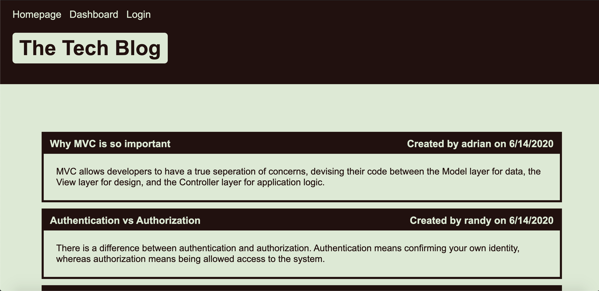

# Tech Blog

## Description
This is a fullstack tech blog where users can create accounts, post content, comment, and delete their posts. This uses MySql, Sequelize, Bcrypt, Express, Handlebars, and Cookies.

## Table of Contents
* [Installation](#installation)
* [Application] (#application) 
* [Preview] (#preview)
* [Usage](#usage)
* [License](#license)
* [Questions](#questions)

## Installation

To install neccesary dependencies, run the following command:

```
npm install
```

## Application

Here is a link to the deployed application: http://anishasnet-tech-blog.herokuapp.com/

## Preview

This is a preview of what the deployed application looks like.


## Usage

The user must run node server to start the server.

## License

This project is under no license.

## Questions

For any further questions please email anishasnet@gmail.com. You can find more of my work at [anishasnet](https://github.com/anishasnet).
    